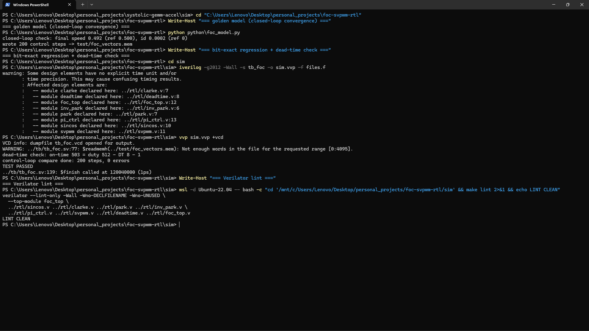
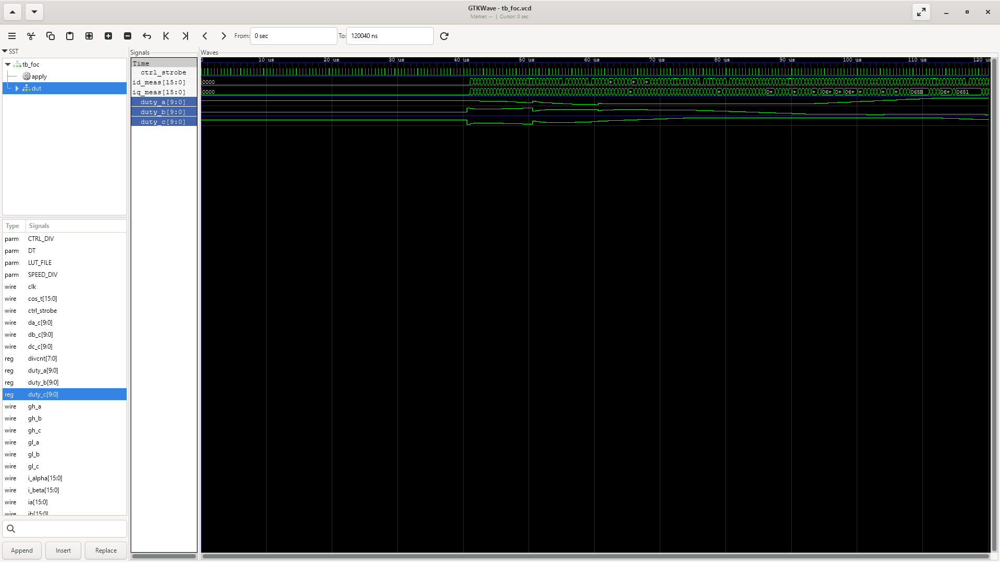

# FOC motor controller with SVPWM (Verilog RTL)

A synthesizable field-oriented-control pipeline for a PMSM: Clarke and Park
transforms, d/q current PI loops and an outer speed PI loop (multi-rate),
inverse Park, SVPWM duty generation, and dead-time insertion on three
complementary PWM pairs. CI checks it against a bit-exact Python golden model
that runs the same integer controller in closed loop with a float motor plant.


## Demo

Closed-loop golden-model convergence, the bit-exact 200-step compare, the dead-time
timing check, and Verilator lint.



The three SVPWM duties settling after the speed step in GTKWave (analog step view).



## How it works

```
ia,ib ──▶ clarke ──▶ park ──▶ PI(d)──┐
 (Q1.15)     ▲         ▲     PI(q)──┴▶ inv_park ──▶ svpwm ──▶ deadtime ──▶ 6 gates
             │      sincos ◀── theta[15:0]           │ da,db,dc (10-bit)
spd_ref,fb ──┴──▶ PI(speed, /20 rate) ──▶ iq_ref     ▼ sector 1..6
```

Fixed point: currents and voltages are Q1.15; the angle is 16-bit unsigned
(0..2^16−1 = 0..2π); PI gains are Q4.12; PI accumulators are Q8.24 with
anti-windup clamping; duties are 10-bit.

sin/cos: a shared 257-entry quarter-wave LUT (Q1.15, 10-bit phase). I used a
lookup rather than CORDIC because a single combinational read at about 0.15%
error is already below the current-sensor LSB (justification in `rtl/sincos.v`).

Multi-rate on one clock: the current loop runs every `CTRL_DIV` (50) cycles on
an enable strobe, the speed loop every `SPEED_DIV` (20) strobes. A strobe that
updates the speed PI still uses the previous `iq_ref` in the current loop, and
the golden model mirrors this ordering.

SVPWM: min/max common-mode injection (equivalent to conventional sector-based
SVPWM); sector 1..6 is decoded from the phase ordering; duties are clamped to
[10, 1013].

Dead time: on any PWM edge both gates drop, then the target gate asserts after
`DT` cycles. The both-off gap is DT+1 cycles (the change detector uses a
registered copy of the input), which the testbench checks exactly.

## Golden model (`python/foc_model.py`, stdlib only)

The model implements every block in bit-exact integer arithmetic and runs the
closed loop against a first-order PMSM dq plant (float) with back-emf coupling,
for a 0 → 0.5 pu speed step. It asserts its own sanity (speed settles at the
reference, d-axis current regulated to zero), writes the sine LUT the RTL
loads, and records 200 control steps of stimulus and expected outputs. Since
the recorded controller is bit-exact to the RTL, the DUT replays the
closed-loop trajectory open-loop and has to match every value.

## Layout

```
foc-svpwm-rtl/
├── rtl/
│   ├── sincos.v      # quarter-wave LUT sin/cos (sin_lut.mem via $readmemh)
│   ├── clarke.v  park.v  inv_park.v
│   ├── pi_ctrl.v     # Q8.24 accumulator, anti-windup clamp, enable strobe
│   ├── svpwm.v       # min/max injection + sector decode
│   ├── deadtime.v    # complementary pair with dead-time
│   └── foc_top.v     # strobe generation + pipeline + PWM counter
├── python/foc_model.py
├── test/foc_vectors.mem
├── tb/tb_foc.sv
└── sim/Makefile
```

## Running it

```bash
cd sim
make            # build + run, expects "TEST PASSED"
make lint       # Verilator -Wall lint
make golden     # regenerate LUT + vectors (deterministic)
```

## Verification

Per control strobe the testbench compares the registered Park outputs (id, iq)
and all three duties bit-for-bit against the golden trajectory (200 steps
covering the speed step, current transients, and steady state). A continuous
monitor checks that complementary gates are never both high, and a directed
check measures phase-A on-time over a full PWM period against `duty − DT − 1`.
Waveforms come from `vvp sim.vvp +vcd`.

## Scope

The plant is a normalized first-order dq model (Ld=Lq, no saturation, no
inverter nonlinearity), and the controller replays recorded closed-loop
stimulus rather than co-simulating the plant in the testbench. Both are
intentional: the focus here is the fixed-point datapath and the bit-exact
verification method.
